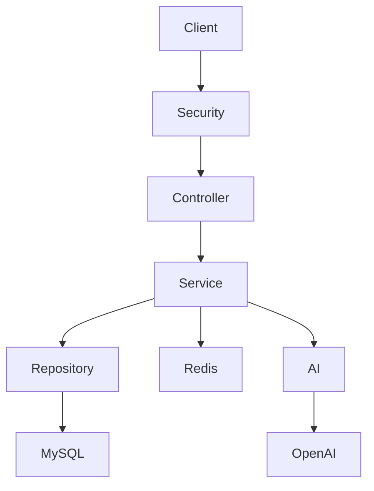

# 💰 SmartSpend

> **AI Personal Finance Manager**

SmartSpend là một ứng dụng quản lý tài chính cá nhân tích hợp AI, giúp người dùng ghi lại thu nhập, chi tiêu, quản lý ngân sách và nhận các phân tích tài chính thông minh dựa trên dữ liệu giao dịch.

Dự án được xây dựng nhằm mục đích học tập, thực hành các công nghệ Backend hiện đại và làm **Portfolio** cho vị trí **Java Backend Developer (Intern/Fresher)**.

---

## ✨ Demo

> 🚧 Đang phát triển...

---

## 📸 Screenshot

> Sẽ cập nhật sau.

---

# 🚀 Tính năng

## 👤 Người dùng

- Đăng ký tài khoản
- Đăng nhập
- JWT Authentication
- Refresh Token
- Quản lý thông tin cá nhân

---

## 💸 Quản lý giao dịch

- Ghi nhận thu nhập
- Ghi nhận chi tiêu
- Chỉnh sửa giao dịch
- Xóa mềm (Soft Delete)
- Tìm kiếm
- Lọc theo thời gian
- Phân trang

---

## 📂 Quản lý danh mục

- Danh mục mặc định
- Danh mục tự tạo
- Phân loại Thu / Chi

---

## 🎯 Quản lý ngân sách

- Tạo ngân sách theo tháng
- Theo danh mục
- Theo dõi tiến độ sử dụng
- Cảnh báo khi vượt ngân sách

---

## 📊 Dashboard

- Tổng thu
- Tổng chi
- Thu - Chi theo tháng
- Chi tiêu theo danh mục
- Xu hướng chi tiêu
- Giao dịch gần đây

---

## 🤖 AI Financial Assistant

Trợ lý AI hỗ trợ phân tích dữ liệu tài chính cá nhân.

Ví dụ:

- Tháng này tôi tiêu nhiều nhất vào đâu?
- Tôi có đang vượt ngân sách không?
- Khoản chi nào nên cắt giảm?
- So sánh chi tiêu tháng này với tháng trước.

---

## 🔔 Thông báo

- Cảnh báo vượt ngân sách
- Thống kê cuối tháng
- Gợi ý từ AI

---

## 📤 Xuất báo cáo

- Excel
- CSV

---

# 🛠 Công nghệ sử dụng

| Nhóm | Công nghệ |
|------|-----------|
| Ngôn ngữ | Java 21 |
| Framework | Spring Boot 3 |
| Security | Spring Security + JWT |
| ORM | Spring Data JPA |
| Database | MySQL 8 |
| Cache | Redis |
| Migration | Flyway |
| AI | OpenAI API |
| API Docs | Swagger |
| Build Tool | Maven |
| Container | Docker |

---

# 🏛 Kiến trúc hệ thống



Dự án được xây dựng theo mô hình **Layered Architecture**, tách biệt rõ giữa các tầng xử lý nhằm đảm bảo dễ bảo trì và mở rộng.

---

# 📂 Cấu trúc dự án

```text
smartspend
│
├── backend
│
├── docs
│   ├── 00-Project-Overview.md
│   ├── 01-Architecture.md
│   ├── 02-Database-Design.md
│   ├── 03-Module-Design.md
│   ├── 04-API-Design.md
│   ├── 05-Business-Rules.md
│   ├── 06-Coding-Conventions.md
│   ├── 07-AI-Module.md
│   ├── 08-UML.md
│   └── 09-Development-Roadmap.md
│
├── docker
│
├── postman
│
├── assets
│
└── README.md
```

---

# 🗄 Cơ sở dữ liệu

Các thực thể chính của hệ thống:

- User
- Category
- Transaction
- Budget
- Notification
- Chat Session
- Chat Message
- Refresh Token
- User Session

> Chi tiết xem tại **docs/02-Database-Design.md**

---

# ⚙️ Hướng dẫn cài đặt

## Clone repository

```bash
git clone https://github.com/<your-account>/smartspend.git

cd smartspend
```

---

## Khởi động MySQL và Redis

```bash
docker compose up -d
```

---

## Chạy ứng dụng

```bash
mvn spring-boot:run
```

---

# 🌐 API Documentation

Sau khi chạy dự án:

Swagger UI

```
http://localhost:8080/swagger-ui/index.html
```

OpenAPI

```
http://localhost:8080/v3/api-docs
```

---

# 📚 Tài liệu

Toàn bộ tài liệu thiết kế được đặt trong thư mục **docs**.

| Tài liệu | Mô tả |
|----------|------|
| Project Overview | Tổng quan dự án |
| Architecture | Kiến trúc hệ thống |
| Database Design | Thiết kế cơ sở dữ liệu |
| Module Design | Thiết kế các module |
| API Design | Thiết kế REST API |
| Business Rules | Quy tắc nghiệp vụ |
| Coding Conventions | Quy ước lập trình |
| AI Module | Thiết kế AI |
| UML | UML Diagram |
| Development Roadmap | Kế hoạch phát triển |

---

# 🗺 Roadmap

- [x] Phân tích yêu cầu
- [x] Thiết kế kiến trúc
- [ ] Thiết kế cơ sở dữ liệu
- [ ] Xây dựng Authentication
- [ ] Quản lý Category
- [ ] Quản lý Transaction
- [ ] Dashboard
- [ ] Budget
- [ ] AI Financial Assistant
- [ ] Export Report
- [ ] Docker Deployment

---

# 💡 Định hướng phát triển

Trong tương lai, SmartSpend có thể được mở rộng với:

- Quét hóa đơn bằng OCR
- Ghi chi tiêu bằng giọng nói
- AI dự đoán xu hướng chi tiêu
- Thiết lập mục tiêu tiết kiệm
- Ứng dụng Mobile
- Đăng nhập bằng Google

---

# 👨‍💻 Tác giả

**Tên:** *Your Name*

**Vai trò:** Java Backend Developer

**GitHub:** https://github.com/<your-account>

---

# 📄 License

Dự án được phát triển cho mục đích học tập và xây dựng Portfolio.