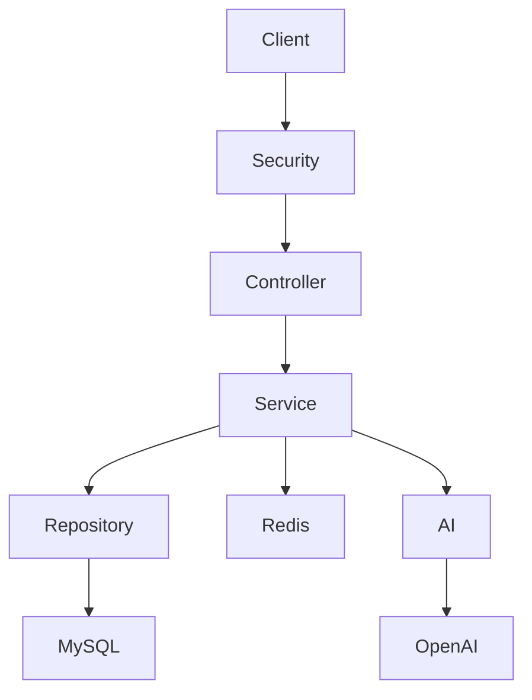

# Tổng quan dự án

# SmartSpend

### AI Personal Finance Manager

---

## 1. Giới thiệu

**SmartSpend** là một ứng dụng quản lý tài chính cá nhân tích hợp trí tuệ nhân tạo (AI), giúp người dùng theo dõi thu nhập, chi tiêu, lập ngân sách và nhận các phân tích tài chính dựa trên dữ liệu giao dịch thực tế.

Dự án được xây dựng với mục tiêu thực hành các công nghệ Backend hiện đại bằng **Java Spring Boot**, đồng thời làm Portfolio phục vụ cho quá trình học tập và ứng tuyển vị trí **Java Backend Developer (Intern/Fresher)**.

---

## 2. Bài toán

Nhiều người có thói quen ghi chép các khoản thu và chi, tuy nhiên việc lưu trữ dữ liệu thôi là chưa đủ.

Người dùng thường gặp các vấn đề như:

- Không biết tiền đang được chi vào đâu nhiều nhất.
- Không kiểm soát được ngân sách hàng tháng.
- Khó theo dõi xu hướng chi tiêu theo thời gian.
- Không có gợi ý để cải thiện thói quen tài chính.

SmartSpend được xây dựng nhằm giải quyết những vấn đề trên bằng cách kết hợp quản lý tài chính cá nhân với khả năng phân tích của AI.

---

## 3. Mục tiêu dự án

Mục tiêu của SmartSpend bao gồm:

- Quản lý thu nhập và chi tiêu cá nhân.
- Theo dõi ngân sách theo từng danh mục.
- Trực quan hóa dữ liệu tài chính thông qua Dashboard.
- Tích hợp AI để phân tích và đưa ra gợi ý tài chính.
- Xây dựng hệ thống Backend theo kiến trúc rõ ràng, dễ mở rộng và dễ bảo trì.

---

## 4. Đối tượng sử dụng

SmartSpend hướng đến người dùng cá nhân có nhu cầu quản lý tài chính hằng ngày.

Ví dụ:

- Sinh viên
- Nhân viên văn phòng
- Freelancer
- Người kinh doanh nhỏ
- Người muốn kiểm soát chi tiêu cá nhân

---

## 5. Phạm vi dự án

### Chức năng được hỗ trợ

- Đăng ký và đăng nhập
- Quản lý danh mục thu nhập và chi tiêu
- Quản lý giao dịch
- Quản lý ngân sách
- Dashboard thống kê
- Thông báo
- AI Financial Assistant
- Xuất báo cáo

### Không nằm trong phạm vi

Phiên bản hiện tại **không hỗ trợ**:

- Ví điện tử
- Chuyển tiền
- Thanh toán trực tuyến
- Internet Banking
- Mobile Banking
- Quản lý đầu tư
- Tiền điện tử (Crypto)

---

## 6. Giá trị nổi bật của dự án

Điểm khác biệt lớn nhất của SmartSpend là tích hợp AI để hỗ trợ người dùng phân tích dữ liệu tài chính.

Thay vì chỉ hiển thị biểu đồ và số liệu, AI có thể trả lời các câu hỏi như:

- Tháng này tôi tiêu nhiều nhất vào đâu?
- Danh mục nào đang tăng mạnh so với tháng trước?
- Tôi có đang vượt ngân sách không?
- Tôi nên cắt giảm khoản chi nào?

Điều này giúp SmartSpend trở thành một **AI Personal Finance Manager**, thay vì chỉ là một ứng dụng ghi chép thu chi.

---

## 7. Chức năng chính

Hệ thống bao gồm các nhóm chức năng sau:

### 1. Xác thực người dùng

- Đăng ký
- Đăng nhập
- JWT Authentication
- Refresh Token
- Quản lý hồ sơ

---

### 2. Quản lý danh mục

- Danh mục thu
- Danh mục chi
- Danh mục mặc định
- Danh mục tự tạo

---

### 3. Quản lý giao dịch

- Ghi nhận thu nhập
- Ghi nhận chi tiêu
- Chỉnh sửa
- Xóa mềm
- Tìm kiếm
- Lọc dữ liệu
- Phân trang

---

### 4. Quản lý ngân sách

- Tạo ngân sách theo tháng
- Theo dõi tiến độ sử dụng
- Cảnh báo vượt ngân sách

---

### 5. Dashboard

- Tổng thu
- Tổng chi
- Chênh lệch thu chi
- Chi tiêu theo danh mục
- Xu hướng chi tiêu theo tháng

---

### 6. AI Financial Assistant

- Phân tích dữ liệu giao dịch
- Đưa ra lời khuyên tài chính
- Trả lời câu hỏi của người dùng

---

### 7. Thông báo

- Cảnh báo ngân sách
- Báo cáo cuối tháng
- Gợi ý từ AI

---

### 8. Xuất báo cáo

- CSV
- Excel

---

## 8. Công nghệ sử dụng

| Thành phần | Công nghệ |
|------------|-----------|
| Ngôn ngữ | Java 21 |
| Framework | Spring Boot 3 |
| Bảo mật | Spring Security + JWT |
| ORM | Spring Data JPA |
| Database | MySQL |
| Cache | Redis |
| Migration | Flyway |
| AI | OpenAI API |
| API Documentation | Swagger |
| Build Tool | Maven |
| Container | Docker |

---

## 9. Kiến trúc tổng quan

Dự án được xây dựng theo mô hình **Layered Architecture**, giúp tách biệt rõ ràng giữa các tầng xử lý, nâng cao khả năng bảo trì và mở rộng.

---

## 10. Các module của hệ thống

| Module | Mô tả |
|---------|------|
| Authentication | Xác thực và phân quyền người dùng |
| Category | Quản lý danh mục thu và chi |
| Transaction | Quản lý giao dịch tài chính |
| Budget | Quản lý ngân sách |
| Dashboard | Thống kê và trực quan hóa dữ liệu |
| Notification | Gửi thông báo |
| AI Assistant | Phân tích tài chính bằng AI |
| Export | Xuất báo cáo |

---

## 11. Lộ trình phát triển

- Giai đoạn 1: Thiết kế hệ thống
- Giai đoạn 2: Xây dựng Authentication
- Giai đoạn 3: Quản lý Category và Transaction
- Giai đoạn 4: Dashboard và Budget
- Giai đoạn 5: AI Financial Assistant
- Giai đoạn 6: Export và tối ưu hệ thống

---

## 12. Kết luận

SmartSpend là một dự án quản lý tài chính cá nhân được phát triển theo hướng hiện đại, tập trung vào kiến trúc Backend, bảo mật và khả năng tích hợp AI.

Thông qua dự án này, mục tiêu không chỉ là xây dựng một ứng dụng quản lý thu chi, mà còn tạo ra một sản phẩm có khả năng hỗ trợ người dùng hiểu rõ hơn về tình hình tài chính và cải thiện thói quen chi tiêu của mình.